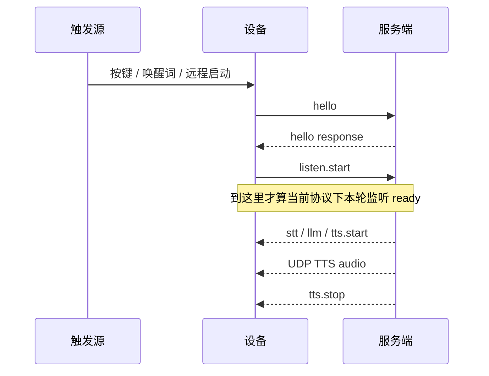

# 会话控制与远程触发协议约定

本文档用于明确设备端与服务端在会话控制消息上的语义边界，重点约定 `hello`、`listen.start`、`tts.start`、`tts.stop`、`abort(reason=remote_trigger)` 的职责，避免把“建链成功”“设备开始监听”“服务端开始说话”混为同一个节点。

本文档同时区分三类语义：
- 当前协议中已经稳定成立的控制语义
- 当前实现建议遵守的保守约束
- 长期要靠设备侧缓冲或显式 ready/ack 才能闭环的能力

适用范围：
- MQTT + UDP 模式
- WebSocket 模式
- 本地按键唤醒、唤醒词唤醒、远程触发

## 1. 核心结论

1. `hello` 只是建链与会话初始化，不表示设备已经开始监听，也不应被服务端当成“设备已可稳定播放服务端音频”。
2. `listen.start` 是当前协议下新一轮监听进入 ready 的最强控制锚点；对于新会话首轮播报，它应作为保守起播门槛，但它仍不是严格意义上的“输出 ready ack”。
3. `tts.start` 表示服务端请求开始本轮 TTS，设备应切向 `speaking`；它不等于设备已经完成 speaking 状态切换。
4. `tts.sentence_start` 只负责文本/UI 展示，不代表音频已经到达。
5. `abort(reason=remote_trigger)` 表示在当前会话内打断旧轮次并注入新的远程触发上下文，不新建 session。
6. 唤醒提示音是设备本地 UX 提示，不是服务端开始播报的门闩条件。
7. 如果目标是“服务端首包音频确定不丢”，仅靠 `hello`、`listen.start` 和经验延迟都不够，长期仍需要设备侧首包缓冲或显式 ready/ack。

## 2. 为什么不能把 hello 当成“可以开始说话”

从服务端可观察语义看，`hello` 完成的是这几个动作：
- 设备声明传输方式与能力
- 服务端返回 `session_id`、音频参数、UDP 连接信息
- 服务端可以开始初始化会话上下文

但此时设备还没有进入 `listening` 状态，也还没有发送 `listen.start`。

对服务端来说，`hello` 的含义应该是：
- 这个 session 可以建立起来
- 可以开始准备本轮会话上下文
- 还不能把它等同为“麦克风已经开始收这轮输入”

因此，对于新会话，服务端不应该在收到 `hello` 后立刻把它当成“设备已 ready，可以直接进入回答阶段”。

补充说明：
- 某些实现会在 `hello` 之后提前准备 TTS/LLM/上下文，这是允许的。
- 但“可以开始准备资源”和“可以立即向设备稳定首播”不是同一个语义。

## 3. 新会话的稳定时序

### 3.1 推荐稳定时序



  上图表达的是推荐稳定时序，不等于所有现有实现已经完全遵守。

### 3.2 服务端应该如何使用这些节点

- 收到 `hello`：建立 session、绑定上下文、准备资源。
- 收到 `listen.start`：把这一刻视为“本轮监听正式开始”，也是当前协议下新会话首轮播报最可信的控制门槛。
- 如果服务端要在新会话里直接播报，推荐在 `listen.start` 之后再发 `tts.start` 与音频，尤其是 MQTT + UDP 场景。
- 但这仍是保守约束，不应被误写成“listen.start 已经严格证明设备输出链路 ready”。

### 3.3 远程空闲唤醒的特殊点

当设备处于 `idle`，远程工具 `self.conversation.start_remote` 会走“新会话”路径：

1. 触发上下文先写入待发送状态。
2. 下一次 `hello` 会带上 `trigger` 对象。
3. 设备进入 `listening` 后再发送 `listen.start`。

这里的 `hello.trigger` 只表示“这次会话为什么被拉起、附带哪些阅读上下文”，不表示服务端可以把 `hello` 直接等同于首轮可播。

说明：
- 当前某些服务端实现会在 `hello.trigger` 到达后尽快准备甚至启动首轮播报。
- 对 MQTT + UDP 新会话首播而言，更稳的约束仍然是等 `listen.start` 之后再进入首轮 `tts.start`。

## 4. 服务端下发 TTS 的约定

### 4.1 控制顺序要求

最低要求如下：

1. 先发 `tts.start`
2. 第一包音频不能早于 `tts.start`
3. `tts.sentence_start` 用于展示文本，可早于第一包音频，也可晚于第一包音频
4. 音频结束后发 `tts.stop`

当前服务端常见顺序是：

1. `tts.start`
2. `tts.sentence_start`
3. 可选的短保护延迟
4. 第一包音频
5. 后续音频
6. `tts.stop`

因此，本协议不要求 `tts.sentence_start` 必须晚于第一包音频；它只要求不要把 `tts.sentence_start` 当成音频到达证明。

### 4.2 不要把展示文本当成音频已到达

`tts.sentence_start` 的职责只是更新设备显示文本。它和 UDP 音频是两条独立路径：
- 控制文本走 MQTT 或 WebSocket
- TTS 音频走 UDP 或 WebSocket 音频帧

因此会出现下面两种情况：
- 设备已经显示了回答文本，但音频包其实还没到
- 设备已经收到 `tts.start`，但如果后续没有音频包，用户听到的仍然是静音

服务端实现上不要用 `tts.sentence_start` 替代音频下发完成度判断。

### 4.3 不要只发控制不发音频

如果服务端决定进入回答轮次，就应保证：
- `tts.start` 后面跟随实际音频数据，或
- 明确这是一个无音频响应，并避免让设备进入“正在说话但没有声音”的体验

这条约定是为了避免出现“UI 有文本、状态已进入 speaking、但整轮没有任何音频包”的假播报。

## 5. 唤醒提示音与服务端音频的关系

唤醒提示音是设备本地播放的提示音，通常触发点在设备进入 `listening` 生命周期附近。

它的语义是：
- 告诉用户设备已经接住这次唤醒
- 不承担服务端 TTS 的起播同步职责

因此服务端不应：
- 等待提示音播完才认为会话开始
- 把“是否听到提示音”当作服务端音频是否可播的判断条件

正确的判断节点仍然是控制消息：
- 新会话首轮播报的保守门槛看 `listen.start`
- 远程注入看 `abort(reason=remote_trigger)`

但要注意：
- `listen.start` 解决的是“不要把 hello 当 ready”这个问题。
- 它不能单独解决“设备 speaking 状态切换与首包音频到达之间的竞态”问题。

## 6. 远程触发约定

### 6.1 设备空闲时

设备处于 `idle` 时，远程触发会启动一个新会话：

```json
{
  "type": "hello",
  "trigger": {
    "trigger_id": "xxx",
    "source": "scheduled_task",
    "phase": "reading"
  }
}
```

随后设备会继续发送：

```json
{
  "session_id": "xxx",
  "type": "listen",
  "state": "start",
  "mode": "manual"
}
```

服务端应将这一类请求理解为：
- 新 session
- 有额外 trigger 上下文
- 在推荐稳定实现下，仍然要等 `listen.start` 才算首轮播报 ready

### 6.2 设备已经在 listening 或 speaking 时

此时不会新开 session，也不会重新发 `hello`。设备会在当前 session 内发送：

```json
{
  "session_id": "xxx",
  "type": "abort",
  "reason": "remote_trigger",
  "trigger": {
    "trigger_id": "xxx",
    "source": "scheduled_task",
    "phase": "reading"
  }
}
```

服务端应把它理解为：
- 终止当前轮次
- 切换到新的远程触发上下文
- 会话不变，`session_id` 不变

换句话说，`abort(reason=remote_trigger)` 是“同一会话内切轮次”，不是“重新建链”。

### 6.3 服务端收到 remote_trigger 后的推荐动作

服务端在收到 `abort(reason=remote_trigger)` 后，应立即：

1. 停掉旧轮次的生成、TTS、工具调用或排队播放。
2. 用 `trigger` 字段刷新当前轮次的业务上下文。
3. 继续在当前 `session_id` 上推进后续流程。

服务端不应该：
- 等一个新的 `hello`
- 把它误判成普通的用户中断但忽略 `trigger`
- 继续沿用旧轮次的业务上下文生成内容

## 7. 设备状态与消息的对应关系

| 控制消息                       | 谁发送 | 语义                           | 设备侧状态含义                                                     |
| ------------------------------ | ------ | ------------------------------ | ------------------------------------------------------------------ |
| `hello`                        | 设备   | 建立会话与音频通道参数协商     | 仍处于 connecting 语义，不代表 listening ready，也不代表输出 ready |
| `listen.start`                 | 设备   | 本轮监听正式开始               | 设备已进入 `listening`，是当前协议下最强的首轮 ready 控制锚点      |
| `tts.start`                    | 服务端 | 请求开始本轮 TTS               | 设备应切到 `speaking`，但不保证状态切换已完成                      |
| `tts.sentence_start`           | 服务端 | 更新展示文本                   | 不保证音频已到达                                                   |
| `tts.stop`                     | 服务端 | 本轮 TTS 结束                  | 设备回到 `idle` 或 `listening`                                     |
| `abort(reason=remote_trigger)` | 设备   | 在当前会话内切换远程触发上下文 | 终止旧轮次，不新建 session                                         |
| `goodbye`                      | 双方   | 关闭会话                       | 音频通道关闭，回落 idle                                            |

## 8. 服务端实现建议

1. 新会话的 ready 判定不要收敛到 MQTT 连接成功或 `hello`；对于 MQTT + UDP 首轮播报，推荐统一收敛到 `listen.start`。
2. 主动播报型业务不要默认抢在 `hello` 后立即说；如果是新会话首轮播报，推荐在 `listen.start` 之后进入 `tts.start`。
3. 远程空闲启动和远程会话内注入要区分处理：
   - 空闲启动看 `hello.trigger + listen.start`
   - 会话内注入看 `abort(reason=remote_trigger)`
4. 排障时把控制通道和音频通道分开看：
   - 有 `tts.sentence_start` 不代表有音频
   - 有 `tts.start` 也不代表音频一定已到设备
5. 如果后续要把“首包稳定可播”做成强保证，不要继续只靠时间调参；要推进设备侧首包缓冲或协议级 ready/ack。

## 9. 当前协议的已知缺口

当前协议里，仍然没有一个显式控制消息能严格表达：
- 设备已经完成 speaking 状态切换
- 设备已经准备好接收并播放第一包服务端音频

因此：
- `hello` 不够
- `listen.start` 更强，但也不等于输出 ready ack
- `tts.start` 只是服务端发起请求，不等于设备已经稳定进入 speaking

如果要让“首包必不丢”成为协议能力，长期建议二选一：

1. 设备侧增加服务端首包缓冲，在进入 `speaking` 后统一 flush。
2. 增加显式 ready/ack，设备确认输出链路 ready 后，服务端再推第一包音频。

## 10. 与现有文档的关系

- 传输层与包格式见 [mqtt-udp.md](./mqtt-udp.md)
- 设备状态迁移见 [device-state-machine-architecture.md](./device-state-machine-architecture.md)

本文档只解决“控制语义在什么时候成立”的问题，不重复展开底层传输细节。