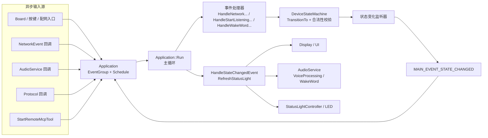
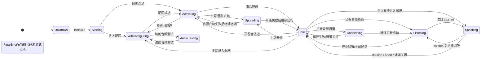
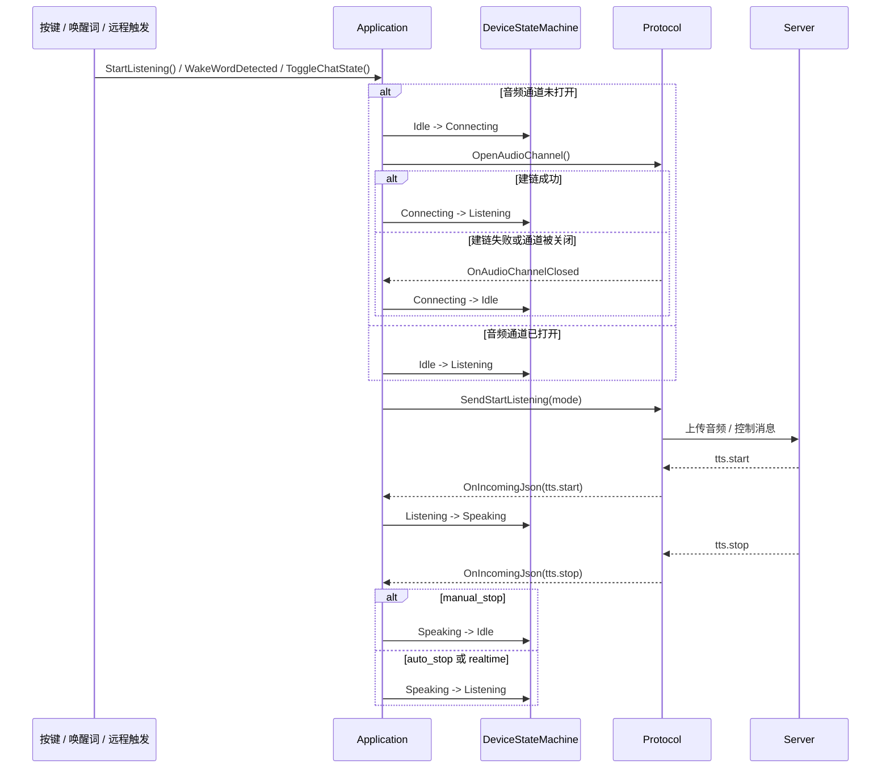
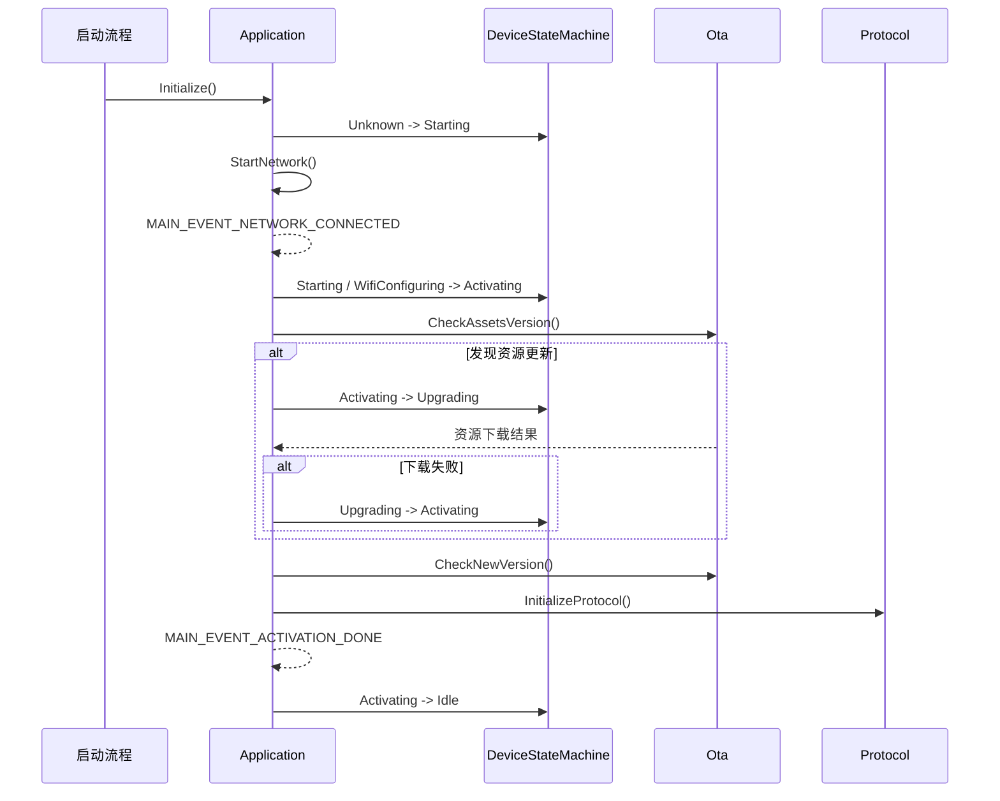

# 设备状态机切换图与架构说明

## 1. 文档目的

本文档用于固化 xiaozhi-esp32 当前设备状态机的实现边界、合法状态迁移、主流程时序，以及事件驱动架构。

本文档关注的是当前代码已经实现的状态机机制，不讨论未来可能新增的业务状态，也不包含代码改动。

## 2. 核心结论

1. 设备状态的唯一校验入口是 DeviceStateMachine，真正负责决定一条边是否合法的是 device_state_machine.cc，而不是各个业务回调。
2. Application 不是一个简单的状态持有者，而是状态机编排中心。网络、音频、按键、协议回调和远程触发都先汇入它，再由它驱动状态迁移。
3. 状态切换后的副作用并不是在 TransitionTo 内直接完成，而是通过 MAIN_EVENT_STATE_CHANGED 回到主循环，再统一执行 UI、音频和状态灯刷新。
4. FatalError 状态目前仍是预留终态。当前主流程代码没有显式进入它的路径。

## 3. 关键组件与职责

| 层级         | 组件                                         | 职责                                                   |
| ------------ | -------------------------------------------- | ------------------------------------------------------ |
| 状态校验层   | DeviceStateMachine                           | 保存当前状态，校验合法迁移，广播状态变化通知           |
| 编排层       | Application                                  | 汇聚异步事件，调度主循环，决定何时调用 SetDeviceState  |
| 输入源       | Board / WifiBoard / StartRemoteMcpTool       | 产生按键、配网、远程触发等外部输入                     |
| 音频输入源   | AudioService                                 | 产生唤醒词、VAD、发送队列可用等事件                    |
| 协议输入源   | Protocol                                     | 产生音频通道打开关闭、网络错误、TTS 开始结束等回调     |
| 状态副作用层 | HandleStateChangedEvent / RefreshStatusLight | 根据新状态刷新显示、语音处理开关、唤醒词开关、LED 灯语 |

## 4. 事件驱动架构图

## 5. 状态定义

| 状态            | 含义       | 典型进入条件                                 |
| --------------- | ---------- | -------------------------------------------- |
| Unknown         | 初始默认值 | 进程启动后、Initialize 之前                  |
| Starting        | 启动中     | Application::Initialize()                    |
| WifiConfiguring | 配网中     | WiFi 超时进入配网，或主动进入配网模式        |
| Activating      | 激活中     | 网络连通后进行资源检查、版本检查、协议初始化 |
| Upgrading       | 升级中     | 资源包下载、固件下载升级                     |
| Idle            | 待机态     | 激活完成，或会话关闭后回落                   |
| Connecting      | 建链中     | 准备打开音频通道                             |
| Listening       | 监听中     | 通道可用后开始采集并上传音频                 |
| Speaking        | 播报中     | 服务端 TTS 开始下发                          |
| AudioTesting    | 音频测试态 | 配网页面内切换到音频测试                     |
| FatalError      | 预留终态   | 当前主流程未显式进入                         |

## 6. 合法状态迁移总图

下图描述的是 device_state_machine.cc 当前定义的合法边，不等同于“每一条边在当前业务里都一定会实际发生”。

## 7. 典型业务迁移说明

| 迁移                                    | 触发来源                                                                        | 说明                                                       |
| --------------------------------------- | ------------------------------------------------------------------------------- | ---------------------------------------------------------- |
| Unknown → Starting                      | Application::Initialize                                                         | 固件启动后立即进入                                         |
| Starting / WifiConfiguring → Activating | HandleNetworkConnectedEvent                                                     | 网络可用后启动激活任务                                     |
| Activating → Upgrading                  | CheckAssetsVersion / UpgradeFirmware                                            | 资源或固件升级期间进入                                     |
| Upgrading → Activating                  | CheckAssetsVersion                                                              | 资源下载失败后回到激活流程                                 |
| Activating → Idle                       | HandleActivationDoneEvent                                                       | 资源、版本、协议初始化完成                                 |
| Idle → Connecting                       | HandleToggleChatEvent / HandleStartListeningEvent / HandleWakeWordDetectedEvent | 需要先打开音频通道                                         |
| Idle → Listening                        | HandleToggleChatEvent / HandleStartListeningEvent                               | 音频通道已经打开时可直接进入监听                           |
| Connecting → Listening                  | ContinueOpenAudioChannel / ContinueWakeWordInvoke                               | OpenAudioChannel 成功后设置监听模式                        |
| Listening → Speaking                    | Protocol::OnIncomingJson                                                        | 收到 tts.start                                             |
| Speaking → Listening                    | Protocol::OnIncomingJson                                                        | 收到 tts.stop，且模式允许继续监听                          |
| Speaking → Idle                         | Protocol::OnIncomingJson / OnAudioChannelClosed                                 | 手动模式结束，或通道被关闭                                 |
| Listening → Idle                        | HandleStopListeningEvent / OnAudioChannelClosed                                 | 主动停听、断网、关闭通道                                   |
| Idle → WifiConfiguring                  | WifiBoard::StartWifiConfigMode                                                  | 空闲态可直接切到配网                                       |
| Speaking / Listening → WifiConfiguring  | WifiBoard::EnterWifiConfigMode                                                  | 实际是先 ResetProtocol 回落到 Idle，再进入 WifiConfiguring |

## 8. 典型会话时序图

下图描述设备从待机进入一轮对话，再根据监听模式回落的主路径。

## 9. 启动与激活时序图

下图描述开机、联网、激活、升级检查到进入待机的主路径。

## 10. 实现注意点

1. 状态副作用是两段式执行。先 TransitionTo，再通过 MAIN_EVENT_STATE_CHANGED 在主循环里统一收敛副作用，这保证了 UI、音频和 LED 更新都发生在主线程语境里。
2. Idle → Listening 和 Idle → Connecting 两条边都会存在，区别只在于音频通道是否已经打开。
3. Speaking / Listening 切到配网不是直接跨边完成，而是先通过 ResetProtocol 让通道关闭并回落到 Idle，再进入 WifiConfiguring。
4. Idle → Speaking 这条边在校验器里是允许的，主要用于兼容协议层可能直接驱动播报的场景；当前常规主链路仍以 Listening → Speaking 为主。
5. FatalError 当前没有生产路径。如果后续真正启用它，建议把进入条件、恢复策略和用户可见反馈一起补齐，而不是只加一个状态值。